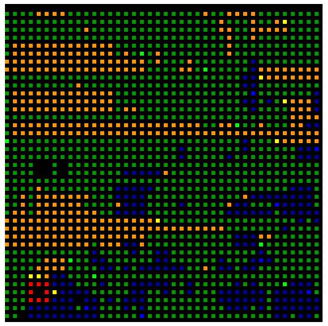

# SQLillo
[SQLillo](https://sqlillo.com/game) was a challange/bot competetion at HackUPC 2022.

Description by the organizers:

>  The challenge itself is really simple.
> 
> There's a map, you can imagine it as a N-dimensional canvas. The map has only integer positions like [1, 2], no decimals allowed! We'll use a Cartesian coordinate system for it. You (a player) are assigned with a unique color. Also, you have a set of what we call workers.
> 
> Each worker has a palette of your unique color and can paint the map. Nevertheless, it can only paint in the vertical and horizontal directions, and the squares that are directly connected to it's position. This is, like a rook in chess but that can only move one square at a time. But beware, there are more players in the map too!
> 
> The challenge will be the following. Every X time units a game iteration will be done, we call it a tick. In every tick each player decides where its workers should go. In the next tick, if there are no collisions (see rules section for details) the workers will be placed in the defined position. When a worker moves to a position it paints its path in the player's unique color. Hence, after few ticks the map will be a beautiful and colorful canvas with the colors of the players. 
> 
> After all the game ticks are simulated, the player with the biggest connected component wins.

# My strategy
My strategy is quite simple. I use two types of workers:

Basic:
- 5 workers out of 8
- select randomly from the 4 patches around them with priority
    1) patches of other players
    2) empty paches
    3) own patches
- If they are in between only own patches, they try to get out by choosing the direction with the closest empty or other players' patch.
- If they get stuck by any means (haven't moved in the last step, they choose random direction to prevent deadlocks with other workers.

"Long distance"
- 5 workers out of 8
- Tries to keep one of 8 (north, east, south, west, north-east, south-east, south-west, north-west) directions, changes direction when meets own color or edge of the playground and with small probability anytime.
- If they are in between only own patches, they try to get out by choosing the direction with the closest empty or other players' patch.
- If they get stuck by any means (haven't moved in the last step, they choose random direction to prevent deadlocks with other workers.

